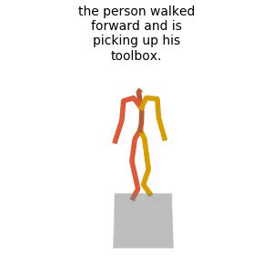
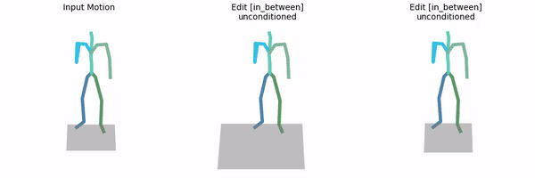

# MDMP: Multi-modal Diffusion for supervised Motion Predictions 

## 🛠️ Getting Started

<details>

### 1. Setup Conda environment

```shell
sudo apt update
sudo apt install ffmpeg
conda env create -f environment.yml
conda activate mdmp
python -m spacy download en_core_web_sm
pip install git+https://github.com/openai/CLIP.git
```
We test our code on Python 3.7.13 and PyTorch 1.7.1

#### Alternative: Pip Installation
<details>
We provide an alternative pip installation in case you encounter difficulties setting up the conda environment.

```
pip install -r requirements.txt
```
We test this installation on Python 3.10

</details>

### 2. Download dependencies:

```bash
bash prepare/download_smpl_files.sh
bash prepare/download_glove.sh
bash prepare/download_t2m_evaluators.sh
bash prepare/download_recognition_models.sh
```

#### Troubleshooting
To address the download error related to gdown: "Cannot retrieve the public link of the file. You may need to change the permission to 'Anyone with the link', or have had many accesses". A potential solution is to run `pip install --upgrade --no-cache-dir gdown`

### 3. Get data

**HumanML3D** - Follow the instructions in [HumanML3D](https://github.com/EricGuo5513/HumanML3D.git),
then copy the result dataset to our repository:

```shell
cp -r ../HumanML3D/HumanML3D ./dataset/HumanML3D
```

<!-- **KIT** - Download from [HumanML3D](https://github.com/EricGuo5513/HumanML3D.git) (no processing needed this time) and the place result in `./dataset/KIT-ML` -->

### 4. Download the pretrained models

```
bash prepare/download_models.sh
```

#### (Optional) Download Manually

[mdmp_pretrained](https://leobringer.com/wp-content/uploads/2024/09/preatrained_model.zip) - it's a zip file, unzip and place them in `./save/`.

</details>


## 👁️ Visuals

<details>
  <summary><b>Demo with Skeletons</b></summary>

### Generate from test set prompts

```shell
python -m sample.generate_w_gt --model_path ./save/mdmp_pretrained/model000500000.pt --num_samples 3 --num_repetitions 3
```

**You may modify the arguments based on your preferences:**
* `--device` id. 
* `--seed` to sample different prompts.
* `--num_samples` to generate more samples conditionned on different inputs
* `--num_repetitions` to generate more samples conditionned on the same inputs

**Running those will get you:**
* `results.npy` file with text prompts and xyz positions of the generated animation
* `sample##_rep##.mp4` - a stick figure animation for each generated motion including the ground-truth motion for comparison.

It will look something like this:



</details>

<details>
  <summary><b>Demo with Skeletons & Presence zones</b></summary>

```shell
python -m sample.generate_w_zones --model_path ./save/mdmp_pretrained/model000500000.pt --num_samples 3 --num_repetitions 3
```

**You may modify the arguments based on your preferences:**
* `--device` id. 
* `--seed` to sample different prompts.
* `--num_samples` to generate more samples conditionned on different inputs
* `--num_repetitions` to generate more samples conditionned on the same inputs

**Running those will get you:**
* `results.npy` file with text prompts and xyz positions of the generated animation
* `sample##_rep##.mp4` - a stick figure animation for each generated motion including zones of presence around 'end-effector' joints to assess uncertainty.
</details>

<details>
  <summary><b>Demo with Human Meshes (Requires Blender)</b></summary>

```shell
python -m sample.generate_for_meshes --model_path ./save/mdmp_pretrained/model000500000.pt --num_samples 3 --num_repetitions 3
```

**You may also define:**
* `--device` id.
* `--seed` to sample different prompts.
* `--motion_length` (text-to-motion only) in seconds (maximum is 9.8[sec]).

**Running those will get you:**
* `results.npy` file with text prompts and xyz positions of the generated animation
* `sample##_rep##.mp4` - a stick figure animation for each generated motion with no ground-truth, no floor, nor zones of presence.

</details>

You can stop here, or render the SMPL mesh using the following script.

### Render SMPL mesh

To create SMPL mesh per frame run:

```shell
python -m visualize.render_mesh --input_path /path/to/mp4/stick/figure/file
```

**This script outputs:**
* `sample##_rep##_smpl_params.npy` - SMPL parameters (thetas, root translations, vertices and faces)
* `sample##_rep##_obj` - Mesh per frame in `.obj` format.

**Notes:**
* The `.obj` can be integrated into Blender/Maya/3DS-MAX and rendered using them.
* This script is running [SMPLify](https://smplify.is.tue.mpg.de/) and needs GPU as well (can be specified with the `--device` flag).
* **Important** - Do not change the original `.mp4` path before running the script.

**Notes for 3d makers:**
* You have two ways to animate the sequence:
  1. Use the [SMPL add-on](https://smpl.is.tue.mpg.de/index.html) and the theta parameters saved to `sample##_rep##_smpl_params.npy` (we always use beta=0 and the gender-neutral model).
  1. A more straightforward way is using the mesh data itself. All meshes have the same topology (SMPL), so you just need to keyframe vertex locations. 
     Since the OBJs are not preserving vertices order, we also save this data to the `sample##_rep##_smpl_params.npy` file for your convenience.

## Motion Editing

* This feature is available for text-to-motion datasets (HumanML3D and KIT).
* In order to use it, you need to acquire the full data (not just the texts).
* We support the two modes presented in the paper: `in_between` and `upper_body`.

### Unconditioned editing

```shell
python -m sample.edit --model_path ./save/humanml_trans_enc_512/model000200000.pt --edit_mode in_between
```

**You may also define:**
* `--num_samples` (default is 10) / `--num_repetitions` (default is 3).
* `--device` id.
* `--seed` to sample different prompts.
* `--edit_mode upper_body` For upper body editing (lower body is fixed).


The output will look like this (blue frames are from the input motion; orange were generated by the model):



* As in *Motion Synthesis*, you may follow the **Render SMPL mesh** section to obtain meshes for your edited motions.

### Text conditioned editing

Just add the text conditioning using `--text_condition`. For example:

```shell
python -m sample.edit --model_path ./save/humanml_trans_enc_512/model000200000.pt --edit_mode upper_body --text_condition "A person throws a ball"
```

The output will look like this (blue joints are from the input motion; orange were generated by the model):


## Train your own MDMP

<details>
  <summary><b>Text to Motion</b></summary>

**HumanML3D**
```shell
python -m train.train_mdmp --save_dir save/my_humanml_trans_enc_512 --dataset humanml
```

**KIT**
```shell
python -m train.train_mdmp --save_dir save/my_kit_trans_enc_512 --dataset kit
```
</details>
<details>
  <summary><b>Action to Motion</b></summary>

```shell
python -m train.train_mdmp --save_dir save/my_name --dataset {humanact12,uestc} --cond_mask_prob 0 --lambda_rcxyz 1 --lambda_vel 1 --lambda_fc 1
```
</details>

<details>
  <summary><b>Unconstrained</b></summary>

```shell
python -m train.train_mdmp --save_dir save/my_name --dataset humanact12 --cond_mask_prob 0 --lambda_rcxyz 1 --lambda_vel 1 --lambda_fc 1  --unconstrained
```
</details>

* Use `--diffusion_steps 50` to train the faster model with less diffusion steps.
* Use `--device` to define GPU id.
* Add `--train_platform_type {ClearmlPlatform, TensorboardPlatform}` to track results with either [ClearML](https://clear.ml/) or [Tensorboard](https://www.tensorflow.org/tensorboard).
* Add `--eval_during_training` to run a short (90 minutes) evaluation for each saved checkpoint. 
  This will slow down training but will give you better monitoring.
* Add `--use_gcn=True` to try the GCN version

## Evaluate

**MPJPE**
```shell
python -m eval.eval_humanml --model_path ./save/humanml_trans_enc_512/model000475000.pt
```

<details>
  <summary><b>Text to Motion</b></summary>

* Takes about 20 hours (on a single GPU)
* The output of this script for the pre-trained models (as was reported in the paper) is provided in the checkpoints zip file.

**HumanML3D**
```shell
python -m eval.eval_humanml --model_path ./save/humanml_trans_enc_512/model000475000.pt
```

**KIT**
```shell
python -m eval.eval_humanml --model_path ./save/kit_trans_enc_512/model000400000.pt
```
</details>

<details>
  <summary><b>Action to Motion</b></summary>

* Takes about 7 hours for UESTC and 2 hours for HumanAct12 (on a single GPU)
* The output of this script for the pre-trained models (as was reported in the paper) is provided in the checkpoints zip file.

```shell
python -m eval.eval_humanact12_uestc --model <path-to-model-ckpt> --eval_mode full
```
where `path-to-model-ckpt` can be a path to any of the pretrained action-to-motion models listed above, or to a checkpoint trained by the user.

</details>


<details>
  <summary><b>Unconstrained</b></summary>

* Takes about 3 hours (on a single GPU)

```shell
python -m eval.eval_humanact12_uestc --model ./save/unconstrained/model000450000.pt --eval_mode full
```

Precision and recall are not computed to save computing time. If you wish to compute them, edit the file eval/a2m/gru_eval.py and change the string `fast=True` to `fast=False`.

</details>

## Acknowledgments

Thanks to Thanks to [guided-diffusion](https://github.com/openai/guided-diffusion), [MDM](https://github.com/GuyTevet/motion-diffusion-model), [TEMOS](https://github.com/Mathux/TEMOS), [ACTOR](https://github.com/Mathux/ACTOR), [HumanML3D](https://github.com/EricGuo5513/HumanML3D), [text-to-motion](https://github.com/EricGuo5513/text-to-motion), and [joints2smpl](https://github.com/wangsen1312/joints2smpl), our code is partially borrowing from them.

## License

This code is distributed under an [MIT LICENSE](LICENSE).

Note that our code depends on other libraries, including CLIP, SMPL, SMPL-X, PyTorch3D, and uses datasets which each have their own respective licenses that must also be followed.