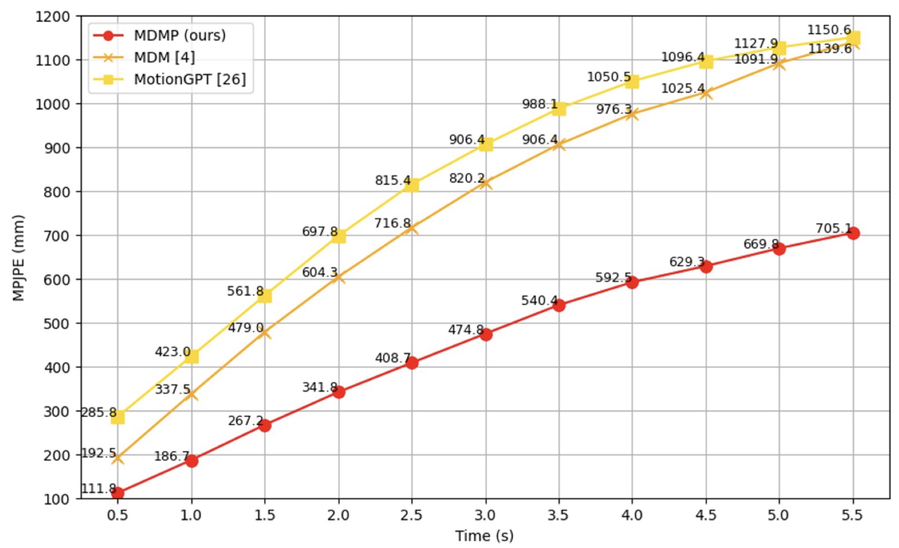

<div align="center">

# MDMP: Multi-modal Diffusion for supervised Motion Predictions

### [[Paper]](https://arxiv.org/abs/2410.03860)
<p align="center">
  
</p>

</div>


## 🛠️ Getting Started

<details>

### 1. Setup Conda environment

```shell
sudo apt update
sudo apt install ffmpeg
conda env create -f environment.yml
conda activate mdmp
python -m spacy download en_core_web_sm
pip install git+https://github.com/openai/CLIP.git
```
We test our code on Python 3.7.13 and PyTorch 1.7.1

#### Alternative: Pip Installation
<details>
We provide an alternative pip installation in case you encounter difficulties setting up the conda environment.

```
pip install -r requirements.txt
```
We test this installation on Python 3.10

</details>

### 2. Download dependencies:

```bash
pip install --upgrade --no-cache-dir gdown
bash prepare/download_smpl_files.sh
bash prepare/download_glove.sh
bash prepare/download_t2m_evaluators.sh
bash prepare/download_recognition_models.sh
```


### 3. Get data

**HumanML3D** - Follow the instructions in [HumanML3D](https://github.com/EricGuo5513/HumanML3D.git),
then copy the result dataset to our repository:

```shell
cp -r ../HumanML3D/HumanML3D ./dataset/HumanML3D
```

<!-- **KIT** - Download from [HumanML3D](https://github.com/EricGuo5513/HumanML3D.git) (no processing needed this time) and the place result in `./dataset/KIT-ML` -->

### 4. Download the pretrained models

```
bash prepare/download_models.sh
```

#### (Optional) Download Manually

[mdmp_pretrained](https://leobringer.com/wp-content/uploads/2024/09/preatrained_model.zip) - it's a zip file, unzip and place them in `./save/`.

</details>


## 👁️ Visuals

<details>
  <summary><b>Demo with Skeletons</b></summary>

### Generate from test set prompts

```shell
python -m sample.generate_w_gt --model_path ./save/mdmp_pretrained/model000500000.pt --num_samples 3 --num_repetitions 3
```

**You may modify the arguments based on your preferences:**
* `--device` id. 
* `--num_samples` to generate more samples conditionned on different inputs
* `--num_repetitions` to generate more samples conditionned on the same inputs
* `--model_path` to change the path if you have trained your own model and want to test it

**Running those will get you:**
* `results.npy` file with text prompts and xyz positions of the generated animation
* `sample##_rep##.mp4` - a stick figure animation for each generated motion including the ground-truth motion for comparison.

It should look something like this:

<div align="center">
  
</div>

</details>

<details>
  <summary><b>Demo with Skeletons & Presence zones</b></summary>

```shell
python -m sample.generate_w_zones --model_path ./save/mdmp_pretrained/model000500000.pt --num_samples 3 --num_repetitions 3
```

**You may modify the arguments based on your preferences:**
* `--device` id. 
* `--num_samples` to generate more samples conditionned on different inputs
* `--num_repetitions` to generate more samples conditionned on the same inputs
* `--model_path` to change the path if you have trained your own model and want to test it


**Running those will get you:**
* `results.npy` file with text prompts and xyz positions of the generated animation
* `sample##_rep##.mp4` - a stick figure animation for each generated motion including zones of presence around 'end-effector' joints to assess uncertainty.

It should look something like this:

<div align="center">
  
</div>

</details>

<details>
  <summary><b>Demo with SMPL Meshes (with Blender)</b></summary>

### Generate simple skeleton videos to be rendered

```shell
python -m sample.generate_for_meshes --model_path ./save/mdmp_pretrained/model000500000.pt --num_samples 3 --num_repetitions 3
```

**You may also define:**
* `--device` id.
* `--num_samples` to generate more samples conditionned on different inputs
* `--num_repetitions` to generate more samples conditionned on the same inputs
* `--model_path` to change the path if you have trained your own model and want to test it

**Running those will get you:**
* `results.npy` file with text prompts and xyz positions of the generated animation
* `sample##_rep##.mp4` - a stick figure animation for each generated motion with no ground-truth, no floor, nor zones of presence.

It should look something like this:

<div align="center">
  
</div>

### Create SMPL parameters

Frow now on if you want to render the SMPL mesh you should chose an `.mp4` file that you would like to render, copy its relative path and use the following script to create SMPL parameters of that file:

```shell
python -m visualize.render_mesh --input_path /path/to/mp4/stick/figure/file
```

**This script outputs:**
* `sample##_rep##_smpl_params.npy` - SMPL parameters (thetas, root translations, vertices and faces)
* `sample##_rep##_obj` - Mesh per frame in `.obj` format.

### Set up blender

Refer to [TEMOS-Rendering motions](https://github.com/Mathux/TEMOS) for blender setup, then install the following dependencies.

```
YOUR_BLENDER_PYTHON_PATH/python -m pip install -r prepare/blender_requirements.txt
```

### Render SMPL meshes

Run the following command to render SMPL using blender:

```
YOUR_BLENDER_PATH/blender --background --python render.py -- --cfg=./configs/render.yaml --npy=YOUR_NPY_FOLDER --mode=video
```

**You may also define:**
- `--mode=video`: render mp4 video
- `--mode=sequence`: render the whole motion in a png image.

**Based on the mode you chose this script outputs:**
* `sample##_rep##_smpl_params.mp4` - a Video with the SMPL parameters rendered with Blender that should look like this:

<div align="center">
  
</div>

* `sample##_rep##_smpl_params.png` - A summary of the sequence through an image that should look like this:

<div align="center">
  
</div>

* It will also create one folder with the `.obj` files and one with each single frame of the video.


</details>

## 🚀 Train your own MDMP

<details>

```shell
python -m train.train_mdmp --save_dir save/my_own_mdmp --dataset humanml
```

* Use `--diffusion_steps 50` to train a faster model with less diffusion steps.
* Use `--device` to define GPU id.
* Add `--train_platform_type {ClearmlPlatform, TensorboardPlatform}` to track results with either [ClearML](https://clear.ml/) or [Tensorboard](https://www.tensorflow.org/tensorboard).
* Add `--use_gcn true` to try the GCN version
* Change `--emb_motion_len` to a value lower than 50 if you want you model to be conditionned on shorter motion sequences
* Add `--num_steps` to specificy the number of training steps and train more or less
* Use `--batch_size` to change to a smaller batch size if your GPU memory gets in the way

</details>

## 📊 Evaluate

<details>
  <summary><b>Accuracy Study (MPJPE)</b></summary>

* Takes about 30mins (on a single GPU) for 3 repetitions per input to go over the entire test set (excluding motion sequences shorter than 3s).
* The output of this script will be printed in the terminal and correspond to the MPJPE at various time steps of the predicted motion (from 0.5 to 5.5s).
* The pre-trained model results should match the ones reported in the temporal chart of the paper (or sometimes lower).

```shell
python -m eval.eval_mpjpe --model_path ./save/mdmp_pretrained/model000500000.pt --num_repetitions 3
```

**You may also define:**
* `--device` id.
* `--num_samples` to generate more samples conditionned on different inputs
* `--num_repetitions` to generate more samples conditionned on the same inputs
* `--model_path` to change the path if you have trained your own model and want to test it

The chart in the paper:
:

</details>

<details>
  <summary><b>Uncertainty Study (Sparsification Error)</b></summary>

* The output of this script will be saved in the folder and correspond to the Sparsification Plot.
* The pre-trained model results should approxiametly match the ones reported in the paper (or sometimes lower).

```shell
python -m eval.eval_spars --model_path ./save/mdmp_pretrained/model000500000.pt --num_samples 10 --num_repetitions 5
```

**You may also define:**
* `--device` id.
* `--num_samples` to generate more samples conditionned on different inputs
* `--num_repetitions` to generate more samples conditionned on the same inputs (usually results in a curve that aligns even closely to the Oracle)
* `--model_path` to change the path if you have trained your own model and want to test it

The plot in the paper: (here we only assess 'Mode Divergence' which is the best index)
:

</details>

## Acknowledgments

Thanks to [guided-diffusion](https://github.com/openai/guided-diffusion), [MDM](https://github.com/GuyTevet/motion-diffusion-model), [MoMask](https://github.com/EricGuo5513/momask-codes), [TEMOS](https://github.com/Mathux/TEMOS), [ACTOR](https://github.com/Mathux/ACTOR), [HumanML3D](https://github.com/EricGuo5513/HumanML3D), [text-to-motion](https://github.com/EricGuo5513/text-to-motion), and [joints2smpl](https://github.com/wangsen1312/joints2smpl), our code is partially borrowing from them.

## License

This code is distributed under an [MIT LICENSE](LICENSE).

Note that our code depends on other libraries, including CLIP, SMPL, SMPL-X, PyTorch3D, and uses datasets which each have their own respective licenses that must also be followed.
